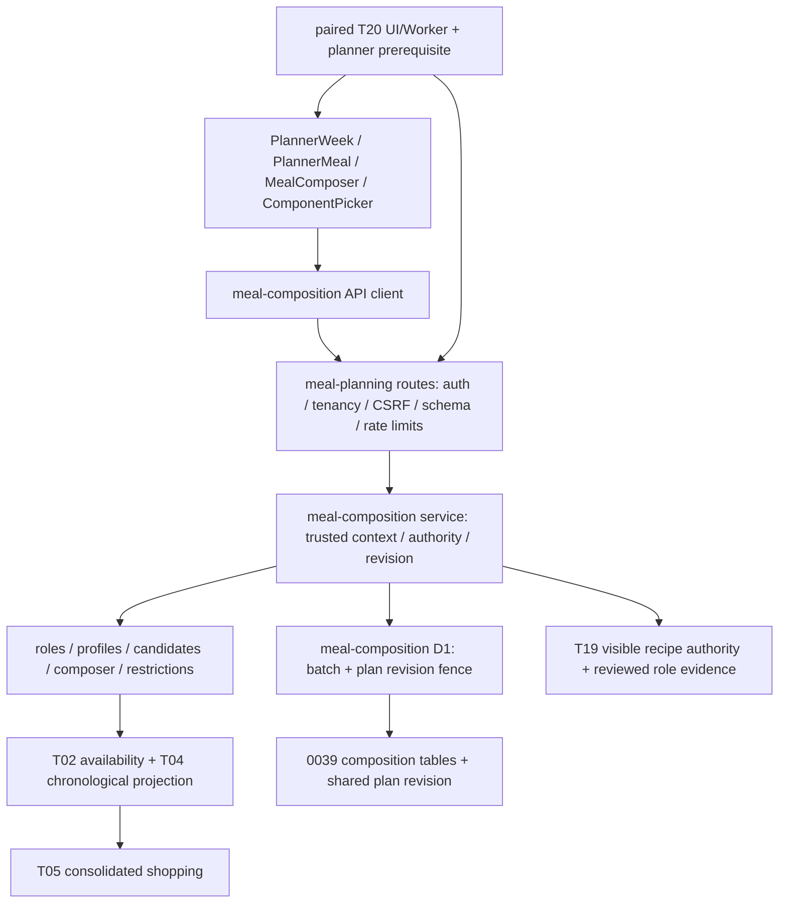

# T20 — Audit takeover và kế hoạch hoàn thiện

## Trạng thái và bằng chứng nền

`T20_GAP_ANALYSIS_COMPLETE` — 2026-10-08 JST. Đây là baseline trước sửa;
phần kiểm chứng cuối tài liệu sẽ ghi kết quả implementation thực.

Repo API xác nhận ID `1385308553`, `vn-tak/Tako-san`, default `main`.
Base/main `6f6eaaab518cf2430de225d0be73d695b40706e4`; nhánh riêng
`codex/t20-production-completion`. PR7/8/9/10/15/16/17/18/19/21 đã merge;
hard-time fix PR18 có trong base. PR20 (T19 docs), PR29 (T21 diagnostics docs)
đang mở, overlap canonical docs; không có PR implementation T20 đang mở.
Giữ nội dung các checkpoint cũ, thêm checkpoint có ngày để tránh xoá lịch sử.

Branch protection: validate, strict, enforce_admins; không force-push. Dù GitHub
không yêu cầu review count, chỉ thị takeover yêu cầu review final head độc lập.
Production Environment cần `vn-taphoanhatung`; không dùng bypass. Không dispatch
hoặc thay remote state trong task này.

Baseline `PATH=/opt/homebrew/opt/node@24/bin:$PATH CI=true TMPDIR=/private/tmp pnpm check`:
exit1, typecheck/lint đạt; tests 6315 PASS, 1 FAIL timeout, 256 files, 132.69s;
không có skipped được báo. Lỗi duy nhất: Wrangler subprocess trong
`tests/unit/staging-d1-catchup-check.test.mjs:169` vượt 5000ms ở lượt full suite.
Chạy riêng cùng môi trường: 32/32 PASS, 3.57s (Wrangler 1280ms). Chưa chứng minh
root cause ngoài contention; không đổi timeout/test. Migration/build chưa chạy
vì command dừng ở tests. Node24.16.0/pnpm10.33.2/Vitest3.2.7.
Evidence local ignored: `.wrangler/t20-completion/20261008/baseline-check.log`,
`baseline-timeout-isolation.log`, `public-baseline.json`; raw session không publish.

Read-only public proof: staging/production source đúng base, D1 source, release
`rel-bd00a4f53fcaeee4`, 500 recipes, no fallback, database/config OK. Production
readiness HTTP200 degraded chỉ bởi cảnh báo `CONFIG_RECIPE_CATALOG_D1_AUTHORITY`.
Final production Deploy run37789673028 SUCCESS; staging37782346206 T20 true,
production37789673028 T20 false; schema39 từ receipt đã xác minh ở task trước.
Không coi public recipe count là bằng chứng toàn bộ hydration; integrity receipt
của release và tests authority là nguồn bổ sung. Không reapply0039.

## Kiến trúc và phụ thuộc

Domain: `packages/recipes/src/composition/{model,roles,simple-foods,profiles,candidates,composer,projection,restrictions}.ts`.
Persistence: `packages/db/src/meal-composition.ts`; service:
`src/worker/services/meal-composition.ts`; API:
`src/worker/routes/meal-planning.ts`; schemas:
`packages/domain/src/meal-composition-api.ts`. Canonical API giữ GET plan/slot,
PUT slot, POST component/swap/assist/assist-apply/auto/auto-apply, PATCH/DELETE
component, GET picker; không thêm API song song. Client autosave mỗi mutation,
reload authoritative plan sau acknowledgement; không cần nút Save giả.

Generation chỉ đọc, apply recompute trusted inputs/identity/locks và check revision.
Batch persistence dùng membership + revision fence; shared revision serializes
V1/T20 writes. Projection đi chronological qua toàn bộ component/family slots,
không ghi physical inventory. Cooking dùng boundary restrictions riêng hiện có.
Không đổi T19 authority routing/scoring weights/tenancy/CSRF/schema.

## Ma trận 28 capability tại baseline

Các test dưới đây đều chạy trong baseline, trừ runtime/browser được ghi riêng.
`tests/unit/` = U, `tests/integration/` = I. Severity chỉ gap còn lại; dấu — là
chưa có defect được chứng minh. COMPLETE_VERIFIED chỉ áp dụng tầng ghi rõ;
không hàm ý live certification.

| # | Capability / trạng thái | Code thực | Tests / quan sát | Gap / severity / phụ thuộc / hành động |
|---|---|---|---|---|
|1|V1→V2 COMPLETE_VERIFIED (local)|model.ts; service|U/t20-meal-composition; I/t20-meal-composition-http: projection không ghi|—; giữ V1/family|
|2|CRUD COMPLETE_VERIFIED (API)|model.ts; DB; routes|I/t20-meal-composition-http: add/lock/swap/reorder/remove; flows: save|UI journey còn cần browser; P2; preview|
|3|Display PARTIAL|PlannerWeek/PlannerMeal/MealComposer|U/t20-meal-composer-ui: role chips|Lỗi load có thể lộ anchor cũ; P1; regression rồi sửa|
|4|Role COMPLETE_VERIFIED|roles.ts; service|I/t20-roles-picker-shopping: 500 distribution/reviewed overrides|—; giữ provenance server|
|5|Simple Food COMPLETE_VERIFIED|simple-foods.ts; restrictions|U/t20-meal-composition, safety, shopping|—; unknown nutrition fail closed|
|6|Manual PARTIAL (UI evidence)|MealComposer/ComponentPicker|U UI picker/filter/focus; I CRUD/revision|A/I browser + save feedback; P2|
|7|Assisted suggestions PARTIAL|composer/service; MealComposer|I flows complete; U UI preview|UI thiếu regenerate_unlocked; P2; reuse assist action|
|8|Assisted apply COMPLETE_VERIFIED (API)|service; DB|I flows stale/forged proposal, no writes until accept|B browser; P2|
|9|Auto COMPLETE_VERIFIED (domain/API)|composer/service|U bounded/determinism; I flows locks/authority|C/I browser; P2|
|10|Cap/fairness COMPLETE_VERIFIED|candidates/composer|U/t20-composer-candidates: 320 incl simple foods, role reservation/input order|—; preserve budgets|
|11|Locks COMPLETE_VERIFIED|model/composer/DB|U 1000 seeded cases; I lock/regenerate race|B browser; P2|
|12|Revision COMPLETE_VERIFIED|DB/service/usePlanner|I flows race variants; I stale-read; client sync gate|G browser; P2|
|13|Tenancy COMPLETE_VERIFIED|routes/service/DB|I flows cross-household read/write/apply; strict input|—; existing auth/CSRF retained|
|14|Hard restrictions COMPLETE_VERIFIED|restrictions/evaluateHardRestrictions|U safety; I legacy-safety + cooking-hard-restrictions|E browser; P2|
|15|Time COMPLETE_VERIFIED (local)|service slot-time context|I HTTP time10/20; I legacy-safety unknown/over limit|Old post-fix live matrix absent for this head; P1 certification gate|
|16|Nutrition COMPLETE_VERIFIED|canonical restrictions; simple foods|U safety/I legacy-safety: unknown hard evidence rejected|—; no invented benefits|
|17|Inventory COMPLETE_VERIFIED|projection.ts; T02/T04|U shopping FEFO/mixed units/substitutes; I shopping|D browser; no physical stock writes|
|18|Weekly PARTIAL (UI evidence)|PlannerWeek/usePlanner; slot composer|I composed V1 regenerate locks; U week display|Verify individual slots don't replace others; P2; whole-week V2 Auto deferred|
|19|Shopping COMPLETE_VERIFIED (arithmetic/API)|projection; meal-shopping service; PlannerShopping|U 300+300−500=100; I T05 HTTP across meals|D browser; unresolved/untracked visibility inspect|
|20|Detail/cooking COMPLETE_VERIFIED (API)|service; recipes/cooking routes|I flows D1-only/static; I t19-cooking-hard-restrictions|F real local browser; P2; no remote consumption|
|21|Mobile IMPLEMENTED_UNVERIFIED|responsive Planner/Picker|U controls, no viewport proof yet|390/768/1280 browser; P2|
|22|Accessibility PARTIAL|picker focus trap; lock aria-pressed; live status|U UI Escape/restore; keyboard reorder controls|Keyboard/axe/touch targets; P2|
|23|Error/empty BROKEN candidate|MealComposer; PlannerMeal; PlannerWeek|U empty picker; no non404 regression yet|Load-error returns null/V1 fallback; P1; fail reproduction|
|24|Flags PARTIAL|composition-flags.mjs; deploy.yml|U/composition-flags off/on/release record|Production planner missing; P1 rollout blocker; guarded draft wiring|
|25|Performance IMPLEMENTED_UNVERIFIED (new baseline)|composer; batch DB; paginated picker|U hard caps; I bounded picker queries|Repeat benchmark median/tail/search/queries; P2|
|26|CI PARTIAL|deploy-check.sh; CI validate|6315 pass + timeout1; isolate32 pass|Final full gates + exact-head hosted; P1 merge gate|
|27|Staging BLOCKED_EXTERNAL (final source)|staging config/deploy gate|Base runtime proof only|Needs reviewed plan/operator approval for new source; P1 certification|
|28|Production BLOCKED_EXTERNAL|release/migration/flag guards|Base D1/schema39/T20-off receipts|Review final head + staging certification + paired prerequisite; P1 release gate|

## Defects cần tái hiện và giải pháp nhỏ nhất

1. P1: composition GET 500/offline/loading hoặc response thiếu slot vẫn có thể
   khiến PlannerMeal/Week hiển thị title/requirements/method V1 cũ. Tái hiện bằng
   component query reject/pending/missing response; chặn legacy body/controls khi
   authoritative composition chưa có. Chỉ 404 server-off được fallback có chủ đích.
   Retry lỗi và missing state rõ ràng; không sửa recipe data.
2. P1 rollout: production chưa có planner server/UI prerequisite; guard hiện chỉ
   staging. Một T20-on release có thể UI bị parent gate che/backend404. Test guard
   production on thiếu prerequisite và wiring; derive planner flags cùng release
   decision trong PR, giữ default off, không thay runtime production.
3. P2: API Assisted hỗ trợ regenerate_unlocked nhưng UI chỉ complete/Auto. Thêm
   nút riêng preview/apply dùng existing action; preserve locks/revision. Test no
   mutation before accept, correct action/variant/id và API lock invariants.

## Phạm vi PR và tiêu chí

Một PR focused: correctness của trạng thái composition, Assisted action còn thiếu,
release prerequisite và behavioral evidence cho existing journeys. Không đổi engine,
weights, authority, persistence hoặc schema nếu chưa có defect mới. Thứ tự:
regression fail → sửa P1 → Assisted → focused gates → browser → benchmark → full
check → canonical docs → commit/push/PR → exact-head CI. Reviewer độc lập sau đó.
Các P1 chưa xác minh phải được ghi rõ, không gọi T20_COMPLETE.

## Deferred classification

| Hạng mục | Phân loại | Lý do |
|---|---|---|
|Non404 error recovery, Manual autosave/reload, Assisted regenerate UI, prerequisite|REQUIRED_FOR_T20_COMPLETION|Core journey và rollout safety|
|Whole-week V2 Auto|OPTIONAL_EXTENSION|Tuần hiện dùng V1 anchors + V2 mỗi slot; xác minh workflow trước. Cần phase riêng shared inventory/locks/revision, không ghép 7 calls|
|Leftovers, per-component servings|DEFERRED_WITH_RATIONALE|Thêm domain/schema khác; không defect của aggregate existing servings|
|Role-curation UI/AI curation|DEFERRED_WITH_RATIONALE|Reviewed server role evidence đã có; không cho client authority|
|Drag-and-drop|OPTIONAL_EXTENSION|Reorder bằng nút/keyboard đã có|
|Real-price scoring/store routing/checkout|DEFERRED_WITH_RATIONALE|Cost proxy không là giá tiền; T05 unknown prices explicit; ngoài scope|

## Kiểm chứng cuối và release packet

Chưa có kết quả implementation ở checkpoint baseline. Bổ sung kết quả thực sau
khi sửa. `CODE_COMPLETE`, `TEST_VERIFIED`, `STAGING_CERTIFIED`, `PRODUCTION_READY`,
`PRODUCTION_ENABLED` là các trạng thái độc lập. Release/rollback sẽ ghi source,
manifest/fingerprint, schema39 ledger, flags, validation và operator gates; không
xoá composition records để rollback và không tự merge/deploy.

## Checkpoint implementation — 2026-10-09 JST

Regression trước sửa: UI 7 FAIL/12 PASS (pending/500/offline/missing + Assisted
regenerate UI); prerequisite 3 FAIL/19 PASS; copy typed error 6 FAIL/56 PASS;
untracked shopping/weekly presentation 2 FAIL/19 PASS. Sau sửa từng nhóm:
UI+flags41 PASS; UI+copy83 PASS. Domain/API111 PASS gồm safety/authority/concurrency.

Hai gap P2 bổ sung đã chứng minh: mã composition validation chỉ hiện lỗi chung
không hướng dẫn recovery; món simple-food không theo dõi bị week gắn nhãn covered
và không được shopping nhắc riêng. Sửa copy vi/en dựa mã allowlist, không lộ server
text; thêm danh sách untracked theo meal, giữ calculator T02/T04/T05 không đổi.

Browser A–I cơ bản:24/24 PASS trên390/768/1280, Worker+SQLite thật D1/500,
Manual4 món/autosave/reload/reorder/role/swap/remove, Assisted2 action giữ locks,
Auto3 bounded options/determinism, rice160+160−220=100g, hard-time rejection,
D1-only detail/cooking reads, hai sessions200/409,500/retry. T20-off3/3 và
UI-on/server-off4043/3 PASS. Đang bổ sung dietary/forbidden/nutrition và untracked.
Các lỗi harness đã sửa theo contract thật: secure cookie dùng browser fetch;
Idempotency-Key cho create; picker theo kind/limit24; exact quantity là string;
V1 projection revisions và downstream stock đổi hợp lệ khi meal trước đổi.
Không thay runtime để làm test xanh. Lượt browser mở rộng đầu bị ngắt sau khi
phát hiện fixture cố chọn simple food mà picker đã chặn; sửa expectation thành
picker exclusion + forged Manual422. Lượt này không được tính PASS.

Benchmark domain: Node24/M1Pro arm64,200 samples/dataset71/320/500; median
0.452/0.428/0.490ms, p95 0.598/0.582/0.617ms; max1.210ms,124 expansions/scores,
4 anchors,22 role candidates,3 options. Composer source byte-identical base,
SHA256 `84c9044575b20c33fd104db640438daa5981d8cd096c32641bdddda68b28be61`.
Pool320 vẫn enforced;500 chỉ stress trực tiếp engine. Không suy ra CPU SLA/cost.
`node scripts/t20-benchmark.mjs` tái lập được; heap delta có GC và ghi ở raw report.

Worker benchmark:20 samples sau3 warmups, real SQLite/catalog500, reset authority
cache mỗi request. Picker median46.30/p9548.79/max48.92ms,14–15 statements,
4781 bytes; Auto median191.44/p95225.95/max227.43ms,29 statements,4186 bytes.
Clock giả lập một phút/sample để giữ limiter thật mà không benchmark throughput.
Một extra SQL ở picker là session last_seen heartbeat, không N+1 recipe read.
Initial benchmark429 do quota và assertion query-identical sai giả định đã được
sửa ở fixture/measurement, không đổi limiter/auth. Test giới hạn SQL<100 và
heartbeat variation≤1; generation không tạo composition hoặc đổi plan revision.
Run `T20_BENCHMARK_OUT=.wrangler/t20-completion/20261008/worker-benchmark.json pnpm exec vitest run tests/integration/t20-performance.test.ts`:1/1 PASS.

Không migration/schema/authority/scoring/physical inventory thay đổi. Workflow
wiring trong PR là bản chuẩn bị review; chưa triển khai ở staging/production.
CODE_COMPLETE/TEST_VERIFIED còn đợi final gates. Staging source mới chưa certified;
production T20 chưa enabled. Final-head review và operator gates vẫn bắt buộc.

## Kết quả UX bổ sung

Final local browser39/39 PASS (13 journeys ×390/768/1280): thêm hard-time10/20,
forbidden/dietary/nutrition fail closed, untracked fruit và UI409 tự canonical
reload. Axe không violation ở Manual region; Escape/focus trap/restore và lock
aria-pressed thực. Reduced-motion và screenshot đã inspect ở ba kích thước.
Touch regression đo summary/link32px, role select36px (FAIL trước sửa), sau sửa
mọi control composer visible đạt≥44px. Unknown slot regression giữ unavailable,
không retry vô hạn (own-review finding đã sửa). Focused final106/106 PASS,
typecheck/lint PASS; full-check trên committed implementation còn chờ.

Flag-off schema regression2/2 PASS với SQLite chỉ apply đến
`0038_auth_onboarding_completion.sql`: static/D1 V1 generate/get/shopping/regenerate
không hề query ba table0039; composition404. Hai flag browser mở rộng phải chạy
sequential: lần parallel Vite first mobile blank/select timeout; không chứng minh
runtime defect. Sequential off3/3 PASS gồm V1 shopping và zero composition calls;
mismatch sequential đang chạy. Base flags/defaults không đổi.

Dependency audit: `pnpm audit --audit-level=high --json` exit1:2critical/16high/
19moderate/4low trong graph đầy đủ; `pnpm audit --prod --audit-level=high --json`
exit0,0high/0critical/2moderate. High/critical paths nằm tooling dev (Vitest/tinypool,
Wrangler/miniflare/undici/sharp, jsdom/ws và tool parsers). Lockfile/dependencies
không đổi trong PR. Đây là maintenance risk phải review riêng, không tuyên bố
security audit toàn repo PASS hay tự nâng tooling/payment/auth ngoài scope.

Release/rollback packet: `docs/ai/T20_RELEASE_READINESS.md`. Self-review không thay
reviewer độc lập; production/staging source mới chưa deploy, remote writes0.

## Chứng nhận local trên implementation đã commit — 2026-10-09 JST

Source implementation: `8592fa6a35890b54833f81282434101ada1e7694`, base
`6f6eaaab518cf2430de225d0be73d695b40706e4`. CODE_COMPLETE ở mức engineering,
`T20_CODE_COMPLETE_REVIEW_REQUIRED` / `T20_TEST_VERIFIED` (local).
Không có P0/P1 implementation còn được chứng minh sau own-review; đây không
phải review độc lập. PR final head gồm documentation checkpoint sau source này;
review và hosted CI phải kiểm tra chính head đó, không tái dùng approval cũ.

- `PATH=/opt/homebrew/opt/node@24/bin:$PATH CI=true TMPDIR=/private/tmp pnpm check`
  exit0: 258/258 files, 6337/6337 tests PASS, không reported skip/failure;
  Vitest132.31s, typecheck/lint/migration smoke/build PASS. Remote schema/Week parity
  được command chủ đích skip vì không có quyền remote mutation/certification.
  Lỗi timeout baseline không tái xuất hiện; không sửa timeout, exclude hoặc assertion.
- Final browser T20on39/39 (111.6s), off3/3 (9.1s), mismatch3/3 (9.4s), retries0,
  không skip/flaky/unexpected. Chạy sequential; các lượt harness/parallel FAIL trước
  được giữ trong phần lịch sử. Browser đã chạy trên cùng bytes code trước commit;
  commit không thay implementation. Backend Worker + SQLite và frontend thật local,
  outbound provider blocked; chưa phải staging certification.
- Hai production builds trên implementation SHA, T20/planner UI cùng true và cùng
  false, đều PASS. `dist/composition-flags.json` ghi đúng từng pair; CLI guard
  `composition-flags.mjs verify` PASS với Worker pair tương ứng. Manifest fixtures
  có nhãn `LOCAL_FLAG_FIXTURE_NOT_APPROVED_RELEASE`, không phải approved release
  manifest và không chứng nhận main ancestry/CI/deploy. Release gate thật chỉ tạo
  manifest sau reviewed merge/exact-main CI và operator authorization.
- `git diff --check` PASS. Source diff không thay domain/service/DB/schema,
  migration, Wrangler configs, dependencies/lockfile, auth/payment hoặc T19/T21
  authority. Workflow chỉ thêm production planner prerequisite cùng normalized
  T20 decision. Existing typed route/schema/revision/CSRF guards giữ nguyên.

Evidence ignored tại `.wrangler/t20-completion/20261008/`: `final-check.log`,
`browser-certified-local.log`, `browser-off-certified.log`,
`browser-mismatch-certified.log`, `flag-on-build.log`, `flag-off-build.log`,
`flag-on-build-record.json`, `flag-off-build-record.json`, benchmark và audit
reports. Không upload session, token hoặc dữ liệu household. Hosted CI receipt,
full final head và PR URL phải được ghi trong PR release evidence sau khi CI chạy.
Docs checkpoint này không giả kết quả CI chưa có.

### Ma trận kết thúc implementation

Các code/test paths dùng cùng mapping U/I ở baseline. `COMPLETE_VERIFIED` dưới đây
chỉ là source/local scope được kiểm tra, không chứng nhận hosted deployment.

| # | Capability / trạng thái hiện tại | Code | Bằng chứng thực | Gap / severity / dependency / hành động |
|---|---|---|---|---|
|1|V1→V2 COMPLETE_VERIFIED|model/service|I HTTP + disabled-schema; projection không ghi|Không gap local; giữ family/V1|
|2|CRUD COMPLETE_VERIFIED|model/DB/routes|I HTTP/flows; browser A CRUD/role/reorder/save/reload|Không gap local; reviewer final head|
|3|Display COMPLETE_VERIFIED|PlannerMeal/PlannerWeek/CompositionLoadState|U UI pending/500/offline/missing/unknown slot; browser A/B/retry|Không V1 anchor khi composition chưa có; hosted smoke còn thiếu|
|4|Role COMPLETE_VERIFIED|roles/service|I roles-picker-shopping, 500 distribution, forged role reject|Không sửa role authority; giữ reviewed provenance|
|5|Simple Food COMPLETE_VERIFIED|simple-foods/restrictions/UI|U safety/shopping; browser A/D/E tracked/untracked|Unknown nutrition fail closed; không giả quantity|
|6|Manual COMPLETE_VERIFIED|MealComposer/ComponentPicker|U UI; browser A bốn món, autosave/reload/role/reorder/swap/remove|Local complete; staging A còn phải chạy|
|7|Assisted suggestions COMPLETE_VERIFIED|composer/service/MealComposer|Browser B hai actions preview không đổi revision; I flows|Explainability/locks qua API hiện có; staging B|
|8|Assisted apply COMPLETE_VERIFIED|service/DB|I flows forged/stale rejection; browser B accept giữ main locked|Local atomic/revision verified; staging B|
|9|Auto COMPLETE_VERIFIED|composer/service|U deterministic budgets; browser C 3 options, preview-no-write/apply|Per-slot scope; whole-week extension riêng|
|10|Cap/fairness COMPLETE_VERIFIED|candidates/composer|U caps/reservation/input order, benchmark|Giữ320/4/6/8/1200/2400/3; không đổi weights|
|11|Locks COMPLETE_VERIFIED|model/composer/DB|U seeded invariants; I races; browser B/G|Không gap local; staged locks/revision evidence|
|12|Revision COMPLETE_VERIFIED|DB/service/usePlanner|I flows/stale-read; browser G 200+409 và UI canonical reload|Không silent overwrite; final reviewer|
|13|Tenancy COMPLETE_VERIFIED|routes/service/DB|I cross-household read/write/apply/CSRF, full suite|Local proof; normal-account staging matrix bắt buộc|
|14|Hard restrictions COMPLETE_VERIFIED|restrictions/canonical T03|U safety; I legacy/cooking; browser E forbidden/dietary forged422|Không bypass; no writes on reject|
|15|Time COMPLETE_VERIFIED|shared slot context/service|I HTTP10/20; browser E10/20 rejects Manual/Auto|Final-source hosted matrix chưa có; P1 release gate|
|16|Nutrition COMPLETE_VERIFIED|restrictions/simple-foods|U/I unknown-hard rejection; browser E nutrition|Không invent nutrition; local only|
|17|Inventory COMPLETE_VERIFIED|projection/T02/T04|U FEFO/substitutions/mixed units; browser A/D stock/events unchanged|Planning không consume stock; hosted before/after cần receipt|
|18|Weekly COMPLETE_VERIFIED (per-slot)|PlannerWeek/usePlanner|Browser B 7 slots giữ other-day identity; U lock regenerate|Whole-week V2 Auto OPTIONAL_EXTENSION; không ghép7 calls|
|19|Shopping COMPLETE_VERIFIED|projection/T05/PlannerShopping|U tomato300+300−500=100g; browser rice160+160−220=100g; untracked fruit explicit|Không double-subtract; unknown prices/conversions vẫn explicit|
|20|Detail/cooking COMPLETE_VERIFIED (local)|authority/service/recipe routes|I static/D1 + cooking restrictions; browser F D1-only picker/detail/cooking/shopping|Không remote consumption; staged authority path cần verify|
|21|Mobile COMPLETE_VERIFIED|Planner/Composer/Picker|39 journeys trên390/768/1280, no overflow, screenshots inspect|Local browser proof; staging viewport matrix|
|22|Accessibility COMPLETE_VERIFIED (tested region)|Composer/Picker|Manual main region axe0; keyboard/focus/Escape/aria-pressed/reduced-motion; targets≥44px|Không claim WCAG toàn app; hosted accessibility smoke|
|23|Error/empty COMPLETE_VERIFIED|LoadState/PlannerMeal/Week/presentation|U pending/offline/500/missing/empty/unknown slot; browser retry/conflict|Typed vi/en actionable; raw text không expose|
|24|Flags COMPLETE_VERIFIED (local)|workflow/composition-flags/Vite record|U22; schema-off2; browser off3+mismatch3; real on/off build guards|Runtime baseline không đổi; operator staged enablement riêng|
|25|Performance COMPLETE_VERIFIED (local)|bounded composer/batch readers|200 samples71/320/500; Worker20 samples, bounded SQL/payload/no writes|Hosted CPU/cost/load unverified; không SLA claim|
|26|CI/test COMPLETE_VERIFIED (local), hosted gate cần final head|deploy-check/CI/new browser config|258files/6337tests/migration/build PASS; browser45PASS|PR exact-head validate phải PASS; sau merge exact-main CI riêng|
|27|Staging BLOCKED_EXTERNAL (new source)|deployment/release packet|Base D1/500/schema39/T20true receipt only|P1 operational gate: independent review + operator deploy + A–I certification|
|28|Production BLOCKED_EXTERNAL|release/schema/paired flags|Base final D1 deployment37789673028 SUCCESS, T20false|P1 operational gate: review + exact-mainCI + staging receipt + operator approval|

### Chứng nhận và bước operator

CODE_COMPLETE: engineering complete, review required. TEST_VERIFIED: local PASS;
hosted CI final head là PR gate riêng. STAGING_CERTIFIED: chưa có cho source mới.
PRODUCTION_READY: chưa đạt vì thiếu independent review và staging certification.
PRODUCTION_ENABLED: false theo baseline production receipt. Không gọi T20_COMPLETE.

Production baseline đã hoàn tất rollout D1 trước takeover: Deploy37789673028,
Worker `f92df570-6cb0-43de-bfa6-a4c7bd7f07d8`, release `rel-bd00a4f53fcaeee4`,
served fingerprint `f8cf8c7ff59df9fe29e246b9e3c9aad0fd155fa8df35bf671ac4d03fa2b5ab37`,
D1/500/schema39/no fallback/T20false. Đây là giải quyết các status rollout cũ;
không đồng nghĩa T20 mới đã enabled. Staging baseline source cùng main/T20true.

Next: reviewer kiểm tra final PR head và hosted validate, operator merge qua
protection rồi pin exact-main CI. Chỉ với authorization riêng mới staging deploy
và certify, rồi production enablement theo `T20_RELEASE_READINESS.md`. Không
recovery/import/replay0039/AI scan. Maintenance tooling vulnerability cần PR riêng;
whole-week Auto, leftovers, servings/curation/drag-and-drop/real prices giữ phân
loại deferred phía trên, không mở rộng engine/schema trong PR này.
