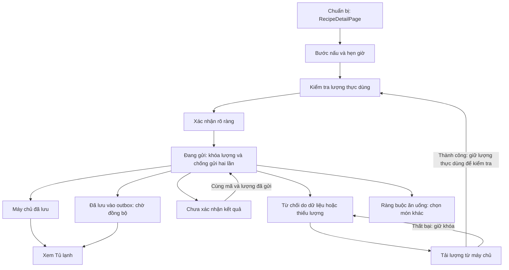

# UI05 - Bếp nấu và kiểm tra lượng thực dùng của Tako-san

Canonical `vn-tak/Tako-san`, checkout `/Users/tunbee27/Documents/Tako-san-ui-rebuild`,
nhánh `codex/ui-rebuild-foundation`; bắt đầu từ `edf2e9a7978c04fc62443e7b3e52d2ae2d895756`.
Packet `docs/ai/tasks/UI05-cooking.md`, ADR-048; đợt local 2026-10-10 JST.
UI05_LOCAL_VERIFIED_REVIEW_REQUIRED. Implementation `IMPLEMENTATION_HASH_PENDING`;
full270files/6514tests PASS. Chi tiết tại [VERIFICATION](VERIFICATION.md).

## Đánh giá thẳng thắn trước khi sửa

| Vấn đề có bằng chứng từ source | Hệ quả cho người dùng | Thay đổi UI05 |
| --- | --- | --- |
| CookingModePage và CookingCompletePage lặp màn xác nhận/handler; bản riêng chỉ console.error | Hai đường vào cùng một việc nhưng lỗi và phản hồi khác nhau | Một CookingReview và một command runner |
| Chỉ +/-50g hoặc1 cho mọi đơn vị còn lại; lượng/đơn vị wire hiển thị trực tiếp | Khó ghi đúng0,125kg hay số lẻ; dễ trừ khác thực tế | Ô number16px, step any, nhãn rõ, giữ blank/zero riêng |
| Mỗi lần thử gọi service sinh commandId mới | Phản hồi bị mất có thể dẫn tới một lần trừ khác | Snapshot lượng và mã yêu cầu ngay lần confirm đầu; retry cùng payload/key |
| Bỏ qua pendingSync và rời màn như đã hoàn tất trên server | Người dùng khó biết tủ là projection hay đã được ghi thật | Phân biệt đã lưu trên máy chủ/chờ đồng bộ; explicit link sang Tủ lạnh |
| Khẩu lệnh giữ currentStepIndex cũ trong closure | “Lùi”, “đọc lại”, “hẹn giờ” có thể dùng bước khác đang nhìn | Callback đọc current store; fence run/route/session/voice generation |
| Tick countdown giảm từng giây;0 chưa dừng running ngay | Chuyển tab làm hẹn giờ chậm; trạng thái nội bộ sai | Deadline thời gian thực, pause/resume, một cảnh báo mỗi generation |
| Recipe không có steps bị dereference | Màn trắng thay vì cách phục hồi | Empty-state có xem lại món/kiểm tra lượng |
| Header mobile dồn exit/title/mic/read, cắt tên; desktop chỉ cột hẹp | Đọc hướng dẫn và thao tác tay khó | Mobile một luồng, desktop context và stage; nút48px, text wrapping |
| Ảnh pasta/mascot cũ được dùng cho mọi món hoàn tất | Hình ảnh không gắn với món đang nấu, nhận diện thiếu nhất quán | Wordmark prototype đúng hệ mới, trạng thái bằng chữ; không ảnh món giả |

Phần chuẩn bị đang ở RecipeDetailPage, không tạo một trang preparation song song.
UI01 đã sửa quantity/no-buy/shortfall và strict conversion ở đây; UI05 giữ chúng,
thêm duy nhất hướng người dùng về yêu cầu cũ nếu một lần hoàn tất còn chưa giải quyết.

## Luồng giao diện và command

Access/idempotency conflict không được tự bỏ mã để gửi một lần trừ mới. Safety
rejection có explicit “Kết thúc và chọn món khác”, không bypass ràng buộc. Khi URL
chuyển món nhưng yêu cầu cũ còn chưa giải quyết, màn recovery nêu đúng món cũ và
liên kết về review; không đặt nội dung cũ dưới danh nghĩa món mới.

Review giữ ô trống là chưa nhập;0 là không dùng. Kiểm tra finite/nonnegative,
max100000 của existing server contract và lượng stock theo đơn vị. Dòng trùng
nguyên liệu dùng chung session reservation, required trước optional; zero/blank
chỉ peek lượng và không reserve. Không đoán khối lượng pack/piece/bunch/slice.
Lượng còn lại hiển thị là dự kiến, không là phiên bản authoritative của từng lô.
Các số hiển thị dùng Intl; ô sửa vẫn giữ lượng chính xác nhận được, kể cả decimal
tail từ dữ liệu stock cũ, để không làm tròn tăng quá lượng strict availability.
Giá trị thực dùng không bị tự clamp sau refresh; lỗi yêu cầu người dùng kiểm tra.

Command runner không điều hướng sau await. Nó chỉ ghi kết quả vào đúng run và
session còn hiện hành; component tự sở hữu focus/status. Rời SPA rồi quay lại giữ
same-run draft/attempt; late refresh của màn đã unmount không sửa run mới. Private
session reset xóa draft và fence phản hồi. Draft/key chưa gửi/ambiguous chỉ trong
memory; document exit có beforeunload. Reload mất draft vẫn là giới hạn hiện tại.

Service giữ body/header idempotency, server authority và outbox existing. Projection
người dùng hiện tại dùng stock snapshot trước attempt, tránh lấy stock sau một
lost-response commit rồi trừ tiếp. Same-key đã queue hoặc concurrent queue không
project hai lần; đổi payload cùng key bị chặn. Xác minh operation thực sự có trong
outbox trước khi trả pendingSync. Success envelope/lot basics phải hợp lệ; unreadable
200, malformed body và5xx không được trình bày là server-success.

## UI, responsive và motion

- Pine/coral/warm canvas, font tự host Be Vietnam Pro, wordmark/symbol prototype
  sẵn có; không thay kit toàn cục hoặc surface payment.
- Context gồm tên món đầy đủ, vị trí bước, progress, outline đóng/mở và voice tùy
  chọn; stage tập trung hướng dẫn, tip, timer và prev/next. Desktop hai cột từ768px.
- Mobile một cột; không fixed footer che nội dung/bàn phím. Safe-area được tính ở
  bốn cạnh; action nằm trong document flow, có thể scroll tới ở390x420.
- Ô quantity16px/48px, +/-48px; container nhỏ280px chuyển control thành hai hàng
  để giữ đủ bề rộng số khi phóng chữ. Tên/nguyên liệu dài wrap, số dùng Intl vi-VN.
- Bước slide12px/opacity180ms theo hướng prev/next; progress dùng transform scaleX.
  Reduced motion bỏ animation/transition; không có pulse/ping liên tục.
- Timer dùng tabular numbers; start/pause/resume/reset/end được announce, countdown
  không nằm trong live region. Zero giữ focusable aria-disabled; Space/Enter no-op,
  Tab tới reset. Reset có sequence mới để cùng thông báo vẫn được đọc.
- Khẩu lệnh không xác nhận trừ tủ. Recognition unsupported/permission error về manual;
  late results/restart/disposer của recognition cũ không tác động recognition mới.

Ảnh đã kiểm tra: [màn nấu mobile](evidence/cooking-390.png),
[màn nấu desktop](evidence/cooking-1440.png), [review mobile](evidence/actual-use-390.png),
[lỗi nhận focus](evidence/completion-uncertain-390-viewport.png).

## Phạm vi còn mở

Brand prototype chưa là kit final: logo/icon/PWA/OG/mascot/voice of brand cần đợt
riêng. UI05 không làm batch ảnh món, canonical remap picker, planner/composer/
shopping/remaining routes. Không schema/backend/quantity-authority cutover.

Chưa kiểm tra điện thoại thật, Safari/OS keyboard/actual browser zoom/screen reader,
usability với người dùng hoặc CWV. Playwright clock và speech mocks chứng minh
contract ứng dụng, không chứng minh hệ điều hành sẽ phát âm báo hay nhận đúng
khẩu lệnh khi ứng dụng bị suspend. PendingSync chỉ chứng minh local operation đang
queue; không chứng minh máy chủ chưa commit trước khi mất phản hồi.

Bước tiếp: UI06 packet cho planner/composer/shopping theo existing flags và Week
compatibility, hoàn tất các surface còn lại rồi brand/media/device/release review.
